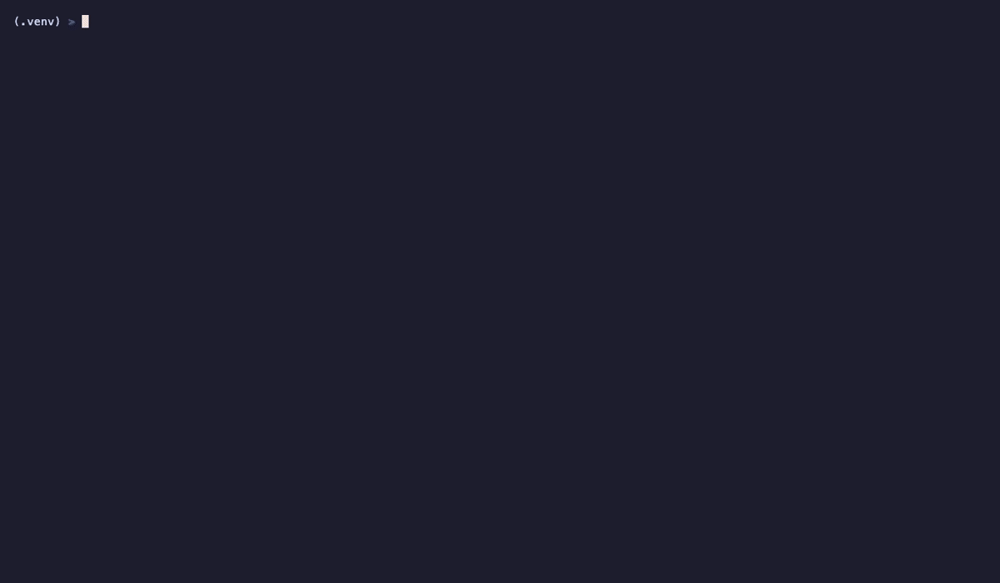

<div align="center">

# artok عرتوك

**Arabic Token Tax Calculator**

See how much more Arabic costs across **18 LLM tokenizers**.

[](LICENSE)
[](https://python.org)
[](#supported-tokenizers-18)

[Website](https://moshe-ship.github.io/artok) · [GitHub](https://github.com/Moshe-ship/artok) · [Report Bug](https://github.com/Moshe-ship/artok/issues)

</div>

---

## Why This Exists

Arabic text uses **2-5x more tokens** than equivalent English depending on the tokenizer. Same meaning, wildly different cost:

| Text | Claude Tokens | GPT-4.1 Tokens |
|------|:---:|:---:|
| `الذكاء الاصطناعي يغير العالم` | **25** | **10** |
| `AI is changing the world` | **5** | **5** |
| **Ratio** | **5.0x** | **2.0x** |

This is the **Arabic Token Tax**. If you're building Arabic AI products, you're paying 2-5x more for the same capabilities. `artok` makes this visible, measurable, and actionable.

<div align="center">

</div>

## Install

```bash
git clone https://github.com/Moshe-ship/artok.git
cd artok
python3 -m venv .venv && source .venv/bin/activate
pip install -e ".[all]"
```

## Quick Start

```bash
# See the tax across all 18 tokenizers
artok "الذكاء الاصطناعي يغير العالم"

# Compare Arabic vs English side by side
artok "الذكاء الاصطناعي" -e "Artificial intelligence"

# Run the Arabic friendliness benchmark (no input needed)
artok --benchmark

# See how diacritics inflate tokens
artok "بِسْمِ اللَّهِ الرَّحْمَنِ الرَّحِيمِ" --tashkeel

# Compare dialects (MSA vs Egyptian vs Gulf vs Levantine vs Moroccan)
artok --dialects

# Heatmap — color each word by token cost
artok "الذكاء الاصطناعي يغير حياتنا" --heatmap

# Rank tokenizers by composite score
artok "نص عربي" --leaderboard

# Estimate monthly costs at 50M tokens
artok "نص عربي" -e "Arabic text" --cost 50

# See savings from switching away from Claude
artok "الذكاء الاصطناعي يغير العالم" --switch-from claude-sonnet

# Compare Arabic against other languages
artok "الذكاء الاصطناعي" --compare-langs 'en:AI|fr:IA|zh:人工智能'

# Analyze Arabic text from a URL
artok --url https://ar.wikipedia.org/wiki/ذكاء_اصطناعي -t gpt4.1,claude-sonnet

# Export as SVG for sharing on X/Twitter
artok "نص عربي" -e "Arabic text" --export results.svg

# Live mode — type and see counts in real-time
artok --watch

# Keep pricing up to date
artok --update
```

## Supported Tokenizers (18)

18 tokenizers across 10 providers. Pricing auto-updates from GitHub (`artok --update`).

| Tokenizer | Provider | Input $/1M | Output $/1M |
|-----------|----------|:----------:|:-----------:|
| GPT-4.1 | OpenAI | $2.00 | $8.00 |
| GPT-4.1 mini | OpenAI | $0.40 | $1.60 |
| GPT-4.1 nano | OpenAI | $0.10 | $0.40 |
| GPT-4o | OpenAI | $2.50 | $10.00 |
| GPT-4o mini | OpenAI | $0.15 | $0.60 |
| Claude Opus 4.6 | Anthropic | $5.00 | $25.00 |
| Claude Sonnet 4.6 | Anthropic | $3.00 | $15.00 |
| Claude Haiku 4.5 | Anthropic | $1.00 | $5.00 |
| Llama 4 | Meta | $0.18 | $0.18 |
| Qwen 3.5 | Alibaba | $0.10 | $0.40 |
| Mistral Large 3 | Mistral | $0.50 | $1.50 |
| Mistral Small | Mistral | $0.10 | $0.30 |
| Gemini 2.5 Pro | Google | $1.25 | $10.00 |
| Gemini 3 Flash | Google | $0.50 | $3.00 |
| DeepSeek V3.2 | DeepSeek | $0.27 | $1.10 |
| Grok 2 | xAI | $2.00 | $10.00 |
| Command R+ | Cohere | $2.50 | $10.00 |
| Jamba 1.5 | AI21 | $0.20 | $0.40 |

## All Features

| Flag | What it does |
|------|-------------|
| `(text)` | Token count across all 18 tokenizers |
| `-e` | Arabic vs English comparison |
| `-t` | Filter to specific tokenizers |
| `-c` | Cost estimate at N million tokens |
| `-w` | Cost estimate at N million words |
| `-f` | Read text from file |
| `--json` | JSON output for scripting |
| `--chart` | Visual bar chart |
| `--viz` | Colored token split visualization |
| `--batch` | Process JSONL/CSV files |
| `--recommend` | Best tokenizer for a budget |
| `--switch-from` | Savings from switching providers |
| `--compare-langs` | Arabic vs other languages |
| `--url` | Analyze Arabic text from a URL |
| `--tashkeel` | Diacritics inflation analysis |
| `--heatmap` | Color words by token cost |
| `--benchmark` | Arabic friendliness score 0-100 |
| `--dialects` | MSA vs Egyptian vs Gulf vs Levantine vs Moroccan |
| `--leaderboard` | Composite score ranking |
| `--watch` | Live interactive mode |
| `--export` | Export to SVG |
| `--update` | Fetch latest pricing from GitHub |
| `--list` | Show all tokenizers with source info |

## The Arabic Token Tax

Most LLM tokenizers are trained primarily on English/Latin text. Arabic characters get split into individual bytes or small fragments instead of whole words. The result: same meaning, 2-5x more tokens, 2-5x higher cost.

**Benchmark results** (`artok --benchmark`):

| Rank | Tokenizer | Arabic Friendliness Score |
|:----:|-----------|:------------------------:|
| 1 | Mistral Large 3 | **92.1/100** |
| 2 | Qwen 3.5 | **91.7/100** |
| 3 | GPT-4.1 | **91.1/100** |
| 4 | Gemini 2.5 Pro | **90.2/100** |
| 5 | Llama 4 | **83.6/100** |
| ... | Grok 2 | 50.3/100 |
| ... | Claude Sonnet 4.6 | **25.6/100** |

**Key findings:**
- **Mistral / Qwen 3.5**: Best for Arabic — dedicated multilingual tokenizers
- **GPT-4.1 / Gemini / DeepSeek / Llama 4**: Good at ~1.5-2.5x vs English
- **Grok 2**: Moderate at ~2.5-3.5x vs English
- **Claude**: Worst for Arabic at ~3.5-5x vs English — byte-level encoding for Arabic

## Auto-Update Pricing

Tokenizer pricing changes frequently. artok handles this automatically:

1. On startup, checks `~/.cache/artok/tokenizers.json` (24h cache)
2. If stale, fetches latest from [tokenizers.json](tokenizers.json) on GitHub
3. Falls back to hardcoded defaults if offline

```bash
artok --update    # Force refresh right now
artok --list      # Shows pricing source (cached vs built-in)
```

**To update pricing for all users:** Edit `tokenizers.json` in this repo. All users get the new prices within 24 hours.

## Architecture

```
artok/
├── cli.py          # CLI entry point, argument parsing
├── core.py         # Tokenizer loading, counting, remote config
├── display.py      # Rich terminal output (tables, charts, heatmaps)
├── __init__.py     # Version
└── __main__.py     # python -m artok support
tokenizers.json     # Remote-updatable pricing config
docs/index.html     # GitHub Pages landing page
```

- **Tokenizer backends**: tiktoken (OpenAI), transformers (HuggingFace), tokenizer_fast (direct tokenizer.json loading for DeepSeek)
- **Output**: Rich tables, colored text, bar charts, SVG export
- **Config**: Hardcoded defaults + GitHub-hosted JSON with 24h local cache

## Contributing

1. Fork the repo
2. Add a tokenizer to `tokenizers.json` (and `core.py` TOKENIZERS list for the hardcoded fallback)
3. Test with `artok --list` and `artok "مرحبا" -t your-new-tokenizer`
4. Open a PR

To update pricing only: edit `tokenizers.json` — no code changes needed.

## License

MIT — [Musa the Carpenter](https://github.com/Moshe-ship)
